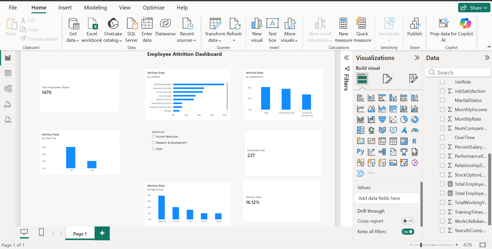

# Employee Attrition Analysis

An end-to-end data analytics project to find why employees leave a company, using the IBM HR Analytics Employee Attrition dataset (1,470 employees).

## Tools Used
- Excel: data cleaning
- MySQL: SQL analysis
- Python (Google Colab): EDA, charts, correlation
- Power BI: interactive dashboard
- GitHub: project documentation

## Project Files
- Employee_Attrition_Cleaned.csv: cleaned dataset
- attrition_analysis.sql: all SQL queries
- Python notebook (.ipynb): EDA and correlation analysis
- Employee_Attrition_Dashboard.pbix: Power BI dashboard
- dashboard.png: dashboard screenshot

## Dashboard

## Key Findings
- Total employees: 1,470. Employees who left: 237. Overall attrition rate: 16.12%.
- OverTime: employees working overtime have 30.53% attrition, compared to 10.44% without overtime.
- Department: Sales (20.63%) and Human Resources (19.05%) have higher attrition than Research & Development (13.84%).
- Age: employees under 25 have the highest attrition (39.18%). Employees aged 35-54 are the most stable (around 10%).
- Tenure: employees with 0-1 years at the company have 34.88% attrition. This drops to 8.13% for employees with 10+ years.
- Job Role: Sales Representatives have the highest attrition (39.76%).
- Correlation: OverTime has the strongest positive correlation with attrition (+0.246). Total working years, job level, monthly income and age have small negative correlations (around -0.16).

## Recommendations
- Review overtime workload, especially in Sales.
- Improve onboarding and support for employees in their first year.
- Focus retention efforts on young employees and Sales Representatives.

## Note
Correlation shows a relationship, not the cause of attrition.
